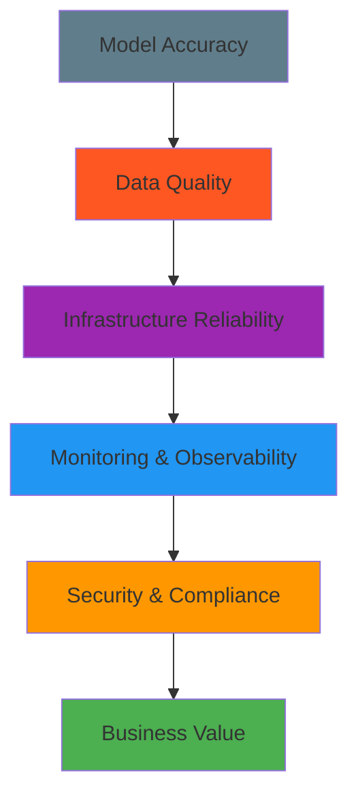

Building AI systems that work in the lab is one thing. **Building AI systems that work reliably in production** is an entirely different challenge. After deploying dozens of ML models to production environments, here are the hard-learned lessons that can save you months of debugging and sleepless nights.

## 🚨 The Reality Check: What They Don't Teach You

> **The Harsh Truth:**
> 
> Your beautiful 99.9% accuracy model that works perfectly on your curated test set will face the chaos of real-world data. Users will input images that are upside down, text with emojis you've never seen, and edge cases that would make your training data weep.

### The Production Pyramid of Needs



Most developers start at the top, but **production success is built from the bottom up**.

## 🏗️ Infrastructure Architecture That Actually Works

### Containerization Strategy

Here's the Docker setup that has saved us countless deployment headaches:

```dockerfile
# Multi-stage build for ML applications
FROM python:3.11-slim as builder

# Install system dependencies
RUN apt-get update && apt-get install -y \
    build-essential \
    libgomp1 \
    && rm -rf /var/lib/apt/lists/*

# Install Python dependencies
COPY requirements.txt .
RUN pip install --no-cache-dir -r requirements.txt

# Production stage
FROM python:3.11-slim as production

# Copy only necessary files
COPY --from=builder /usr/local/lib/python3.11/site-packages /usr/local/lib/python3.11/site-packages
COPY --from=builder /usr/local/bin /usr/local/bin

# Create non-root user for security
RUN useradd --create-home --shell /bin/bash mluser
USER mluser
WORKDIR /home/mluser/app

# Copy application code
COPY --chown=mluser:mluser . .

# Health check
HEALTHCHECK --interval=30s --timeout=30s --start-period=5s --retries=3 \
    CMD python health_check.py

EXPOSE 8000
CMD ["gunicorn", "--bind", "0.0.0.0:8000", "--workers", "4", "app:application"]
```

### Kubernetes Deployment with Auto-scaling

```yaml
# k8s-deployment.yaml
apiVersion: apps/v1
kind: Deployment
metadata:
  name: ml-model-api
spec:
  replicas: 3
  selector:
    matchLabels:
      app: ml-model-api
  template:
    metadata:
      labels:
        app: ml-model-api
    spec:
      containers:
      - name: ml-api
        image: your-registry/ml-model:latest
        resources:
          requests:
            memory: "1Gi"
            cpu: "500m"
          limits:
            memory: "2Gi"
            cpu: "1000m"
        env:
        - name: MODEL_VERSION
          value: "v2.1.0"
        - name: REDIS_URL
          valueFrom:
            secretKeyRef:
              name: redis-secret
              key: url
        livenessProbe:
          httpGet:
            path: /health
            port: 8000
          initialDelaySeconds: 30
          periodSeconds: 10
        readinessProbe:
          httpGet:
            path: /ready
            port: 8000
          initialDelaySeconds: 5
          periodSeconds: 5
---
apiVersion: v1
kind: Service
metadata:
  name: ml-model-service
spec:
  selector:
    app: ml-model-api
  ports:
  - port: 80
    targetPort: 8000
  type: LoadBalancer
---
apiVersion: autoscaling/v2
kind: HorizontalPodAutoscaler
metadata:
  name: ml-model-hpa
spec:
  scaleTargetRef:
    apiVersion: apps/v1
    kind: Deployment
    name: ml-model-api
  minReplicas: 3
  maxReplicas: 20
  metrics:
  - type: Resource
    resource:
      name: cpu
      target:
        type: Utilization
        averageUtilization: 70
  - type: Resource
    resource:
      name: memory
      target:
        type: Utilization
        averageUtilization: 80
```

## 📊 Monitoring That Actually Helps

### The Three Pillars of ML Monitoring

<div class="row">
<div class="col-md-4">

#### 🔧 System Metrics
- **Latency**: P50, P95, P99
- **Throughput**: Requests/second
- **Error Rate**: 4xx/5xx responses
- **Resource Usage**: CPU, Memory, GPU

</div>
<div class="col-md-4">

#### 🎯 Model Metrics
- **Prediction Accuracy**: Real-time validation
- **Feature Drift**: Statistical tests
- **Output Distribution**: Unexpected patterns
- **Confidence Scores**: Model uncertainty

</div>
<div class="col-md-4">

#### 💼 Business Metrics
- **User Engagement**: Click-through rates
- **Revenue Impact**: A/B test results
- **Cost per Prediction**: Infrastructure costs
- **ROI**: Business value delivered

</div>
</div>

### Prometheus + Grafana Setup

```python
# monitoring.py - Custom metrics collection
from prometheus_client import Counter, Histogram, Gauge, start_http_server
import time
import numpy as np

# Define metrics
prediction_counter = Counter('ml_predictions_total', 'Total predictions made', ['model_version', 'status'])
prediction_latency = Histogram('ml_prediction_duration_seconds', 'Prediction latency')
model_accuracy = Gauge('ml_model_accuracy', 'Current model accuracy')
feature_drift_score = Gauge('ml_feature_drift_score', 'Feature drift detection score')

class ModelMonitor:
    def __init__(self, model_version="v1.0.0"):
        self.model_version = model_version
        self.recent_predictions = []
        self.ground_truth_buffer = []
        
    @prediction_latency.time()
    def predict_with_monitoring(self, features):
        """Make prediction with comprehensive monitoring."""
        start_time = time.time()
        
        try:
            # Validate input features
            if not self._validate_features(features):
                prediction_counter.labels(
                    model_version=self.model_version, 
                    status='invalid_input'
                ).inc()
                raise ValueError("Invalid input features")
            
            # Make prediction
            prediction = self.model.predict(features)
            confidence = self.model.predict_proba(features).max()
            
            # Record metrics
            prediction_counter.labels(
                model_version=self.model_version, 
                status='success'
            ).inc()
            
            # Store for drift detection
            self.recent_predictions.append({
                'features': features,
                'prediction': prediction,
                'confidence': confidence,
                'timestamp': time.time()
            })
            
            # Cleanup old predictions (keep last 1000)
            if len(self.recent_predictions) > 1000:
                self.recent_predictions = self.recent_predictions[-1000:]
            
            return {
                'prediction': prediction,
                'confidence': confidence,
                'model_version': self.model_version,
                'latency': time.time() - start_time
            }
            
        except Exception as e:
            prediction_counter.labels(
                model_version=self.model_version, 
                status='error'
            ).inc()
            raise
    
    def update_accuracy(self, ground_truth_batch):
        """Update model accuracy with recent ground truth data."""
        if not self.recent_predictions:
            return
        
        # Calculate accuracy for recent predictions
        correct_predictions = 0
        total_predictions = 0
        
        for truth in ground_truth_batch:
            # Find corresponding prediction
            pred = next((p for p in self.recent_predictions 
                        if abs(p['timestamp'] - truth['timestamp']) < 300), None)
            if pred:
                if pred['prediction'] == truth['actual']:
                    correct_predictions += 1
                total_predictions += 1
        
        if total_predictions > 0:
            accuracy = correct_predictions / total_predictions
            model_accuracy.set(accuracy)
    
    def detect_feature_drift(self):
        """Detect feature drift using statistical tests."""
        if len(self.recent_predictions) < 100:
            return
        
        # Simple drift detection using feature distribution
        recent_features = np.array([p['features'] for p in self.recent_predictions[-100:]])
        baseline_features = np.array([p['features'] for p in self.recent_predictions[:100]])
        
        # Calculate KL divergence or similar metric
        drift_score = self._calculate_drift_score(recent_features, baseline_features)
        feature_drift_score.set(drift_score)
        
        return drift_score
    
    def _validate_features(self, features):
        """Validate input features."""
        # Add your validation logic here
        return True
    
    def _calculate_drift_score(self, recent, baseline):
        """Calculate feature drift score."""
        # Simplified drift calculation
        recent_mean = np.mean(recent, axis=0)
        baseline_mean = np.mean(baseline, axis=0)
        return np.linalg.norm(recent_mean - baseline_mean)

# Start Prometheus metrics server
start_http_server(8001)
```

## 🛡️ Data Quality and Validation

### Input Validation Pipeline

```python
# data_validation.py
from typing import Dict, List, Any, Optional
import pandas as pd
import numpy as np
from dataclasses import dataclass
from enum import Enum

class ValidationLevel(Enum):
    STRICT = "strict"
    WARNING = "warning"
    PERMISSIVE = "permissive"

@dataclass
class ValidationResult:
    is_valid: bool
    errors: List[str]
    warnings: List[str]
    cleaned_data: Optional[Dict[str, Any]] = None

class DataValidator:
    def __init__(self, schema: Dict[str, Any], level: ValidationLevel = ValidationLevel.STRICT):
        self.schema = schema
        self.level = level
    
    def validate(self, data: Dict[str, Any]) -> ValidationResult:
        """Comprehensive data validation."""
        errors = []
        warnings = []
        cleaned_data = data.copy()
        
        # Check required fields
        for field, rules in self.schema.items():
            if rules.get('required', False) and field not in data:
                errors.append(f"Missing required field: {field}")
                continue
            
            if field not in data:
                continue
            
            value = data[field]
            
            # Type validation
            expected_type = rules.get('type')
            if expected_type and not isinstance(value, expected_type):
                if self.level == ValidationLevel.STRICT:
                    errors.append(f"Field {field} must be of type {expected_type.__name__}")
                else:
                    try:
                        cleaned_data[field] = expected_type(value)
                        warnings.append(f"Auto-converted {field} to {expected_type.__name__}")
                    except (ValueError, TypeError):
                        errors.append(f"Cannot convert {field} to {expected_type.__name__}")
            
            # Range validation
            if 'min' in rules and value < rules['min']:
                if self.level == ValidationLevel.STRICT:
                    errors.append(f"Field {field} below minimum value {rules['min']}")
                else:
                    cleaned_data[field] = rules['min']
                    warnings.append(f"Clamped {field} to minimum value")
            
            if 'max' in rules and value > rules['max']:
                if self.level == ValidationLevel.STRICT:
                    errors.append(f"Field {field} above maximum value {rules['max']}")
                else:
                    cleaned_data[field] = rules['max']
                    warnings.append(f"Clamped {field} to maximum value")
            
            # Custom validation functions
            if 'validator' in rules:
                try:
                    is_valid, message = rules['validator'](value)
                    if not is_valid:
                        errors.append(f"Field {field}: {message}")
                except Exception as e:
                    errors.append(f"Validation error for {field}: {str(e)}")
        
        # Data quality checks
        quality_errors = self._check_data_quality(cleaned_data)
        errors.extend(quality_errors)
        
        return ValidationResult(
            is_valid=len(errors) == 0,
            errors=errors,
            warnings=warnings,
            cleaned_data=cleaned_data if len(errors) == 0 else None
        )
    
    def _check_data_quality(self, data: Dict[str, Any]) -> List[str]:
        """Additional data quality checks."""
        errors = []
        
        # Check for suspicious values
        for key, value in data.items():
            if isinstance(value, (int, float)):
                if np.isnan(value) or np.isinf(value):
                    errors.append(f"Invalid numeric value for {key}: {value}")
            elif isinstance(value, str):
                if len(value.strip()) == 0:
                    errors.append(f"Empty string value for {key}")
                # Check for potential injection attacks
                suspicious_patterns = ['<script', 'javascript:', 'DROP TABLE', 'SELECT *']
                if any(pattern.lower() in value.lower() for pattern in suspicious_patterns):
                    errors.append(f"Suspicious content detected in {key}")
        
        return errors

# Example usage
image_schema = {
    'width': {'type': int, 'min': 1, 'max': 4096, 'required': True},
    'height': {'type': int, 'min': 1, 'max': 4096, 'required': True},
    'format': {'type': str, 'validator': lambda x: (x.lower() in ['jpg', 'png', 'webp'], "Invalid format")},
    'data': {'type': str, 'required': True}
}

validator = DataValidator(image_schema, ValidationLevel.WARNING)
```

## 🎯 Performance Optimization Strategies

### Model Optimization Techniques

<div class="alert alert-info" role="alert">
  <h4 class="alert-heading">💡 Pro Tip: The 80/20 Rule of ML Optimization</h4>
  <p>80% of your performance gains will come from 20% of optimizations. Focus on these high-impact areas first:</p>
  <ul>
    <li><strong>Model Quantization</strong>: Reduce precision without losing accuracy</li>
    <li><strong>Batch Processing</strong>: Process multiple requests together</li>
    <li><strong>Caching</strong>: Cache frequent predictions and intermediate results</li>
    <li><strong>Model Pruning</strong>: Remove unnecessary parameters</li>
  </ul>
</div>

### Caching Strategy Implementation

```python
# caching.py - Multi-level caching system
import redis
import pickle
import hashlib
import time
from typing import Any, Optional, Callable
from functools import wraps

class MLCache:
    def __init__(self, redis_url: str, default_ttl: int = 3600):
        self.redis_client = redis.from_url(redis_url)
        self.default_ttl = default_ttl
        self.local_cache = {}  # In-memory cache for ultra-fast access
        self.cache_stats = {
            'hits': 0,
            'misses': 0,
            'local_hits': 0,
            'redis_hits': 0
        }
    
    def _generate_key(self, data: Any) -> str:
        """Generate consistent cache key from input data."""
        serialized = pickle.dumps(data, protocol=pickle.HIGHEST_PROTOCOL)
        return hashlib.sha256(serialized).hexdigest()
    
    def get(self, key: str) -> Optional[Any]:
        """Get value from cache with fallback chain."""
        # Try local cache first (fastest)
        if key in self.local_cache:
            entry = self.local_cache[key]
            if entry['expires'] > time.time():
                self.cache_stats['hits'] += 1
                self.cache_stats['local_hits'] += 1
                return entry['value']
            else:
                del self.local_cache[key]
        
        # Try Redis cache
        try:
            value = self.redis_client.get(key)
            if value:
                deserialized = pickle.loads(value)
                # Store in local cache for future access
                self.local_cache[key] = {
                    'value': deserialized,
                    'expires': time.time() + 300  # 5 minutes local TTL
                }
                self.cache_stats['hits'] += 1
                self.cache_stats['redis_hits'] += 1
                return deserialized
        except Exception as e:
            print(f"Redis cache error: {e}")
        
        self.cache_stats['misses'] += 1
        return None
    
    def set(self, key: str, value: Any, ttl: Optional[int] = None) -> bool:
        """Set value in both local and Redis cache."""
        if ttl is None:
            ttl = self.default_ttl
        
        # Store in local cache
        self.local_cache[key] = {
            'value': value,
            'expires': time.time() + min(ttl, 300)  # Max 5 minutes local
        }
        
        # Store in Redis
        try:
            serialized = pickle.dumps(value, protocol=pickle.HIGHEST_PROTOCOL)
            return self.redis_client.setex(key, ttl, serialized)
        except Exception as e:
            print(f"Redis cache set error: {e}")
            return False
    
    def cached_prediction(self, ttl: int = 3600):
        """Decorator for caching model predictions."""
        def decorator(func: Callable) -> Callable:
            @wraps(func)
            def wrapper(*args, **kwargs):
                # Generate cache key from arguments
                cache_key = f"pred:{func.__name__}:{self._generate_key((args, kwargs))}"
                
                # Try to get from cache
                cached_result = self.get(cache_key)
                if cached_result is not None:
                    return cached_result
                
                # Execute function and cache result
                result = func(*args, **kwargs)
                self.set(cache_key, result, ttl)
                return result
            
            return wrapper
        return decorator
    
    def get_stats(self) -> dict:
        """Get cache performance statistics."""
        total_requests = self.cache_stats['hits'] + self.cache_stats['misses']
        hit_rate = self.cache_stats['hits'] / total_requests if total_requests > 0 else 0
        
        return {
            **self.cache_stats,
            'hit_rate': hit_rate,
            'total_requests': total_requests
        }

# Usage example
cache = MLCache("redis://localhost:6379")

@cache.cached_prediction(ttl=1800)  # Cache for 30 minutes
def expensive_model_prediction(features):
    # Your expensive model inference here
    time.sleep(2)  # Simulate processing time
    return {"prediction": "example", "confidence": 0.95}
```

## 🔄 CI/CD for ML Models

### Automated Testing Pipeline

```yaml
# .github/workflows/ml-pipeline.yml
name: ML Model CI/CD

on:
  push:
    branches: [main, develop]
  pull_request:
    branches: [main]

env:
  PYTHON_VERSION: "3.11"
  DOCKER_REGISTRY: "your-registry.com"

jobs:
  test:
    runs-on: ubuntu-latest
    steps:
    - uses: actions/checkout@v3
    
    - name: Set up Python
      uses: actions/setup-python@v4
      with:
        python-version: ${{ env.PYTHON_VERSION }}
    
    - name: Install dependencies
      run: |
        pip install -r requirements.txt
        pip install -r requirements-test.txt
    
    - name: Run unit tests
      run: pytest tests/unit/ -v --cov=src --cov-report=xml
    
    - name: Run integration tests
      run: pytest tests/integration/ -v
    
    - name: Model validation tests
      run: |
        python scripts/validate_model.py
        python scripts/benchmark_performance.py
    
    - name: Data validation tests
      run: python scripts/validate_training_data.py
    
    - name: Upload coverage to Codecov
      uses: codecov/codecov-action@v3

  model-quality:
    runs-on: ubuntu-latest
    needs: test
    steps:
    - uses: actions/checkout@v3
    
    - name: Download model artifacts
      run: aws s3 cp s3://your-models/latest/ ./models/ --recursive
    
    - name: Run model quality checks
      run: |
        python scripts/check_model_drift.py
        python scripts/validate_model_performance.py
        python scripts/check_data_quality.py
    
    - name: Generate model report
      run: python scripts/generate_model_report.py

  security-scan:
    runs-on: ubuntu-latest
    steps:
    - uses: actions/checkout@v3
    
    - name: Run security scan
      uses: securecodewarrior/github-action@v2
      with:
        token: ${{ secrets.SCW_TOKEN }}
    
    - name: Dependency vulnerability scan
      run: safety check -r requirements.txt

  deploy-staging:
    runs-on: ubuntu-latest
    needs: [test, model-quality, security-scan]
    if: github.ref == 'refs/heads/develop'
    steps:
    - uses: actions/checkout@v3
    
    - name: Build Docker image
      run: |
        docker build -t ${{ env.DOCKER_REGISTRY }}/ml-model:staging .
        docker push ${{ env.DOCKER_REGISTRY }}/ml-model:staging
    
    - name: Deploy to staging
      run: |
        kubectl config use-context staging
        kubectl set image deployment/ml-model-api ml-api=${{ env.DOCKER_REGISTRY }}/ml-model:staging
        kubectl rollout status deployment/ml-model-api
    
    - name: Run smoke tests
      run: python scripts/smoke_tests.py --environment=staging

  deploy-production:
    runs-on: ubuntu-latest
    needs: [test, model-quality, security-scan]
    if: github.ref == 'refs/heads/main'
    steps:
    - uses: actions/checkout@v3
    
    - name: Manual approval
      uses: trstringer/manual-approval@v1
      with:
        secret: ${{ github.TOKEN }}
        approvers: tech-leads
        minimum-approvals: 2
    
    - name: Blue-Green deployment
      run: |
        # Your blue-green deployment script
        python scripts/blue_green_deploy.py --version=$(git rev-parse --short HEAD)
```

## 📈 Key Metrics and KPIs

### Business Impact Dashboard

Here are the metrics that actually matter to stakeholders:

| Metric Category | Key Indicators | Target Values |
|----------------|----------------|---------------|
| **Performance** | Latency (P95) | < 200ms |
| | Throughput | > 1000 RPS |
| | Availability | 99.9% |
| **Quality** | Model Accuracy | > 95% |
| | Prediction Confidence | > 80% |
| | Data Quality Score | > 98% |
| **Business** | Cost per Prediction | < $0.001 |
| | Revenue Impact | +15% |
| | User Satisfaction | > 4.5/5 |

## 🚀 Next Steps and Scaling

As your ML systems grow, consider these advanced patterns:

1. **Multi-Model Serving**: Deploy multiple model versions with traffic splitting
2. **Feature Stores**: Centralized feature management and serving
3. **Model Governance**: Track model lineage, versions, and compliance
4. **Edge Deployment**: Move inference closer to users
5. **AutoML Pipelines**: Automated model retraining and deployment

---

## 💡 Key Takeaways

> **Remember:** The goal isn't to build the most sophisticated ML system—it's to build a system that reliably delivers business value while being maintainable and scalable.

- ✅ **Start with monitoring** - You can't improve what you can't measure
- ✅ **Validate everything** - Input data, model outputs, and business metrics
- ✅ **Plan for failure** - Circuit breakers, fallbacks, and graceful degradation
- ✅ **Optimize iteratively** - Profile first, then optimize the bottlenecks
- ✅ **Think long-term** - Technical debt in ML systems is expensive to fix

Building production ML systems is challenging, but with the right patterns and practices, you can create systems that not only work but thrive in the chaos of the real world.

*What's your biggest challenge with ML in production? Share your experiences in the comments below!*
