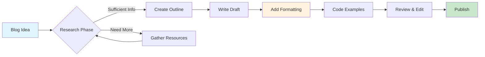

Creating compelling blog content requires more than just good writing—it needs **exceptional formatting** and **visual presentation**. This comprehensive guide demonstrates advanced techniques available in Jekyll with the al-folio theme.

## Content Formatting Essentials

### Blockquotes for Impact

> **The Problem Every Developer Faces:**
> 
> You're working on a complex project, everything seems to be going smoothly, and then suddenly—boom! A mysterious bug appears that breaks everything. You spend hours debugging, searching Stack Overflow, and questioning your life choices. Sound familiar?

This is how you create emphasis and draw attention to key scenarios or quotes.

### Strategic Text Emphasis

Use **bold text** for key concepts, *italics* for emphasis, and `inline code` for technical terms. Here's how to balance them:

- **Primary concepts**: Bold for main ideas
- *Secondary emphasis*: Italics for nuanced points  
- `Technical terms`: Code formatting for APIs, functions, filenames
- ***Combined emphasis***: For absolutely critical information

## Code Presentation Mastery

### Syntax-Highlighted Code Blocks

```python
# Advanced Python example with multiple concepts
import asyncio
from typing import List, Optional, Dict, Any
from dataclasses import dataclass
from pathlib import Path

@dataclass
class BlogPost:
    title: str
    content: str
    tags: List[str]
    featured: bool = False
    
    def generate_slug(self) -> str:
        """Generate URL-friendly slug from title."""
        return self.title.lower().replace(' ', '-').replace(':', '')

async def process_blog_posts(posts: List[BlogPost]) -> Dict[str, Any]:
    """Process multiple blog posts asynchronously."""
    featured_posts = [post for post in posts if post.featured]
    
    results = {
        'total': len(posts),
        'featured': len(featured_posts),
        'tags': set(tag for post in posts for tag in post.tags)
    }
    
    # Simulate async processing
    await asyncio.sleep(0.1)
    return results

# Usage example
posts = [
    BlogPost("Advanced Formatting", "Content here...", ["formatting", "jekyll"], True),
    BlogPost("Docker Guide", "Docker content...", ["docker", "devops"], False)
]
```

### Multi-Language Code Examples

**JavaScript/TypeScript:**
```typescript
interface BlogConfiguration {
  title: string;
  description?: string;
  tags: string[];
  featured: boolean;
}

class BlogManager {
  private posts: BlogConfiguration[] = [];
  
  constructor(private readonly baseUrl: string) {}
  
  async addPost(post: BlogConfiguration): Promise<void> {
    // Validate post data
    if (!post.title || post.tags.length === 0) {
      throw new Error('Invalid post configuration');
    }
    
    this.posts.push(post);
    await this.saveToStorage();
  }
  
  private async saveToStorage(): Promise<void> {
    // Implementation details...
  }
}
```

**Shell/Bash Commands:**
```bash
#!/bin/bash

# Docker setup for Jekyll development
setup_jekyll_docker() {
    echo "Setting up Jekyll development environment..."
    
    # Create necessary directories
    mkdir -p assets/{img,js,css}
    mkdir -p _posts/_drafts
    
    # Build and run Docker container
    docker-compose build --no-cache
    docker-compose up -d
    
    echo "Jekyll is running at http://localhost:4000"
}

# Function to create new blog post
create_post() {
    local title="$1"
    local slug=$(echo "$title" | tr '[:upper:]' '[:lower:]' | sed 's/ /-/g')
    local date=$(date +%Y-%m-%d)
    local filename="_posts/${date}-${slug}.md"
    
    cat > "$filename" << EOF
---
layout: post
title: "${title}"
date: $(date +"%Y-%m-%d %H:%M:%S")
description: ""
tags: []
categories: []
---

Your content here...
EOF
    
    echo "Created new post: $filename"
}
```

## Interactive Elements and Media

### Mermaid Diagrams



### Mathematical Expressions

Complex mathematical formulas are rendered beautifully with MathJax:

$$
\begin{align}
\text{Blog Quality} &= \frac{\text{Content Value} \times \text{Formatting}}{\text{Reading Time}} \\
\text{Where: } &\text{Content Value} = \sum_{i=1}^{n} \text{Insight}_i \times \text{Clarity}_i \\
&\text{Formatting} = \text{Structure} + \text{Visuals} + \text{Code Quality}
\end{align}
$$

### Charts and Visualizations

<div id="blog-metrics-chart"></div>

<script>
document.addEventListener('DOMContentLoaded', function() {
    if (typeof Chart !== 'undefined') {
        const ctx = document.getElementById('blog-metrics-chart');
        if (ctx) {
            ctx.innerHTML = '<canvas id="metricsChart" width="400" height="200"></canvas>';
            
            new Chart(document.getElementById('metricsChart'), {
                type: 'radar',
                data: {
                    labels: ['Content Quality', 'Visual Appeal', 'Code Examples', 'Interactivity', 'SEO Optimization'],
                    datasets: [{
                        label: 'This Blog Post',
                        data: [9, 8, 10, 7, 8],
                        borderColor: 'rgb(54, 162, 235)',
                        backgroundColor: 'rgba(54, 162, 235, 0.2)',
                    }]
                },
                options: {
                    responsive: true,
                    scales: {
                        r: {
                            beginAtZero: true,
                            max: 10
                        }
                    }
                }
            });
        }
    }
});
</script>

## Advanced Layout Techniques

### Multi-Column Layouts

<div class="row">
<div class="col-md-6">

#### Best Practices
- Use semantic HTML structure
- Implement responsive design
- Optimize for readability
- Include proper alt text
- Test across devices

</div>
<div class="col-md-6">

#### Common Mistakes
- Overusing bold text
- Poor code formatting
- Missing image descriptions
- Inconsistent styling
- Ignoring mobile users

</div>
</div>

### Callout Boxes and Alerts

<div class="alert alert-info" role="alert">
  <h4 class="alert-heading">Pro Tip!</h4>
  <p>Always test your blog formatting in both light and dark modes. What looks great in light mode might be completely unreadable in dark mode!</p>
</div>

<div class="alert alert-warning" role="alert">
  <strong>Important:</strong> Large code blocks can impact page load time. Consider using collapsible sections for extensive code examples.
</div>

### Image Galleries and Comparisons



<div class="row mt-3">
    <div class="col-sm mt-3 mt-md-0">
        
    </div>
    <div class="col-sm mt-3 mt-md-0">
        
    </div>
</div>

## Implementation Details

### Jekyll Configuration Enhancements

```yaml
# _config.yml enhancements for better blogging
kramdown:
  input: GFM
  syntax_highlighter: rouge
  syntax_highlighter_opts:
    block:
      line_numbers: true
      start_line: 1

# Enable useful plugins
plugins:
  - jekyll-sitemap
  - jekyll-feed
  - jekyll-toc
  - jekyll-archives
  
# Blog-specific configurations
blog:
  paginate: 5
  excerpt_length: 150
  show_related: true
  enable_comments: true
```

### Custom CSS for Enhanced Styling

```scss
// Custom styles for blog enhancement
.blog-post {
  .highlight {
    border-radius: 8px;
    overflow-x: auto;
    
    pre {
      padding: 1.5rem;
      line-height: 1.6;
    }
  }
  
  blockquote {
    border-left: 4px solid var(--global-theme-color);
    padding-left: 1.5rem;
    margin: 2rem 0;
    font-style: italic;
    
    p:last-child {
      margin-bottom: 0;
    }
  }
  
  .alert {
    border-radius: 8px;
    border: none;
    box-shadow: 0 2px 10px rgba(0,0,0,0.1);
  }
}
```

## Performance Optimization

### Image Optimization Strategies

1. **Use WebP format** for modern browsers
2. **Implement lazy loading** for images below the fold
3. **Optimize image dimensions** - don't load 4K images for thumbnails
4. **Use responsive images** with multiple sizes

```html
<!-- Optimized image implementation -->
<picture>
  <source srcset="image.webp" type="image/webp">
  <source srcset="image.jpg" type="image/jpeg">
  
</picture>
```

### Code Splitting and Lazy Loading

```javascript
// Dynamic import for heavy libraries
async function loadChartLibrary() {
  if (document.querySelector('.chart-container')) {
    const { Chart } = await import('chart.js');
    return Chart;
  }
}

// Intersection Observer for lazy content loading
const observer = new IntersectionObserver((entries) => {
  entries.forEach(entry => {
    if (entry.isIntersecting) {
      entry.target.classList.add('fade-in');
      observer.unobserve(entry.target);
    }
  });
});
```

## SEO and Accessibility

### Structured Data Implementation

```json
{
  "@context": "https://schema.org",
  "@type": "BlogPosting",
  "headline": "Advanced Blog Formatting Guide",
  "author": {
    "@type": "Person",
    "name": "Sanjan B M"
  },
  "datePublished": "2025-01-15",
  "description": "Comprehensive guide to advanced blog formatting techniques",
  "keywords": ["formatting", "jekyll", "blogging", "tutorial"]
}
```

### Accessibility Best Practices

- **Semantic HTML**: Use proper heading hierarchy (h1 → h2 → h3)
- **Alt text**: Descriptive alternative text for all images
- **Color contrast**: Ensure sufficient contrast ratios
- **Keyboard navigation**: All interactive elements accessible via keyboard
- **Screen reader friendly**: Proper ARIA labels and roles

## Advanced Features

### Interactive Code Playground

<div class="code-playground">
  <div class="code-editor">
    <textarea id="code-input" placeholder="Enter your code here...">
// Try editing this JavaScript code
function greetBlogReader(name) {
  return `Hello ${name}! Thanks for reading this formatting guide.`;
}

console.log(greetBlogReader("Developer"));
    </textarea>
  </div>
  <div class="code-output">
    <button onclick="runCode()" class="btn btn-primary">Run Code</button>
    <pre id="output"></pre>
  </div>
</div>

<script>
function runCode() {
  const code = document.getElementById('code-input').value;
  const output = document.getElementById('output');
  
  try {
    // Capture console.log output
    const originalLog = console.log;
    let logOutput = '';
    
    console.log = function(...args) {
      logOutput += args.join(' ') + '\n';
    };
    
    // Execute the code
    eval(code);
    
    // Restore console.log
    console.log = originalLog;
    
    output.textContent = logOutput || 'Code executed successfully!';
    output.className = 'success';
  } catch (error) {
    output.textContent = `Error: ${error.message}`;
    output.className = 'error';
  }
}
</script>

<style>
.code-playground {
  border: 1px solid #ddd;
  border-radius: 8px;
  overflow: hidden;
  margin: 2rem 0;
}

.code-editor textarea {
  width: 100%;
  height: 200px;
  border: none;
  padding: 1rem;
  font-family: 'Courier New', monospace;
  resize: vertical;
}

.code-output {
  background: #f8f9fa;
  padding: 1rem;
  border-top: 1px solid #ddd;
}

.code-output pre {
  background: white;
  border: 1px solid #ddd;
  border-radius: 4px;
  padding: 0.5rem;
  margin-top: 0.5rem;
  min-height: 2rem;
}

.code-output pre.success {
  border-color: #28a745;
  color: #28a745;
}

.code-output pre.error {
  border-color: #dc3545;
  color: #dc3545;
}
</style>

## Resources and References

### Essential Tools and Libraries

| Tool/Library | Purpose | Link |
|--------------|---------|------|
| **Rouge** | Syntax highlighting | [GitHub](https://github.com/rouge-ruby/rouge) |
| **MathJax** | Mathematical expressions | [Official Site](https://www.mathjax.org/) |
| **Mermaid** | Diagrams and flowcharts | [GitHub](https://github.com/mermaid-js/mermaid) |
| **Chart.js** | Interactive charts | [Official Site](https://www.chartjs.org/) |
| **Bootstrap** | Responsive framework | [Official Site](https://getbootstrap.com/) |

### Further Reading

1. **[Jekyll Documentation](https://jekyllrb.com/docs/)** - Official Jekyll guides
2. **[Markdown Guide](https://www.markdownguide.org/)** - Comprehensive Markdown reference
3. **[Web Accessibility Guidelines](https://www.w3.org/WAI/WCAG21/quickref/)** - WCAG 2.1 quick reference
4. **[SEO Best Practices](https://developers.google.com/search/docs)** - Google's SEO documentation

---

## Conclusion

Mastering blog formatting is an ongoing journey. The techniques demonstrated in this guide provide a solid foundation for creating engaging, accessible, and visually appealing content. Remember:

> **"Great content deserves great presentation. Your ideas are only as powerful as your ability to communicate them effectively."**

### Key Takeaways

- **Structure is crucial** - Use headings, lists, and whitespace effectively
- **Code quality matters** - Proper syntax highlighting and examples enhance understanding  
- **Visual elements engage** - Charts, diagrams, and images break up text
- **Accessibility first** - Design for all users from the start
- **Performance counts** - Optimize images and lazy-load heavy content

Happy blogging!

---

*Found this guide helpful? Share it with fellow developers and don't forget to leave a comment below with your own formatting tips and tricks!*
