<section class="hero-block agentic-ai-hero">
  <h1 class="hero-title">The Ultimate Guide to Learning Agentic AI</h1>
  <div class="hero-meta">
    Educational Technology Guide
     · 
    November 2025
  </div>
  
  <p class="hero-lead">A comprehensive roadmap to mastering Agentic AI with curated learning resources, practical projects, and expert insights from leading researchers and practitioners in the field.</p>
  
  <div class="hero-metrics-grid">
    <div class="hero-metric">
      <h3>6 Courses</h3>
      <p>Curated Resources</p>
    </div>
    <div class="hero-metric">
      <h3>100+ Hours</h3>
      <p>Learning Content</p>
    </div>
    <div class="hero-metric">
      <h3>15+ Projects</h3>
      <p>Hands-on Practice</p>
    </div>
    <div class="hero-metric">
      <h3>3 Levels</h3>
      <p>Beginner to Expert</p>
    </div>
    <div class="hero-metric">
      <h3>6-12 Months</h3>
      <p>Learning Timeline</p>
    </div>
  </div>
</section>

The field of **Agentic AI** is revolutionizing how we think about artificial intelligence. Unlike traditional AI systems that respond to specific prompts, agentic AI systems can plan, reason, use tools, and autonomously pursue complex goals. If you're looking to master this cutting-edge domain, you've come to the right place.

## What is Agentic AI?

> **Agentic AI** refers to AI systems that can act autonomously, make decisions, and pursue goals without constant human supervision. These systems combine large language models with planning, tool use, memory, and reasoning capabilities to solve complex, multi-step problems.

### Key Characteristics of Agentic AI:
- **Goal-oriented behavior**: Systems that can define and pursue objectives autonomously
- **Autonomous reasoning and planning**: Advanced decision-making capabilities without human intervention
- **Tool usage and integration**: Ability to interact with external APIs, databases, and software systems
- **Memory and context management**: Persistent storage and retrieval of relevant information across interactions
- **Self-reflection and improvement**: Capability to analyze performance and optimize behavior over time
- **Multi-agent collaboration**: Coordination and communication between multiple AI agents

---

## The Complete Learning Roadmap

### Phase 1: Foundations (Weeks 1-4)

Before diving into agentic systems, ensure you have a solid foundation in:

<div class="row">
<div class="col-md-6">

#### Prerequisites
- **Python Programming** (Advanced)
- **Machine Learning Fundamentals**
- **Deep Learning & Neural Networks**
- **Natural Language Processing**
- **Large Language Models (LLMs)**

</div>
<div class="col-md-6">

#### Essential Concepts
- **Transformer Architecture**
- **Attention Mechanisms**
- **Fine-tuning Techniques**
- **Prompt Engineering**
- **API Integration**

</div>
</div>

### Phase 2: Core Agentic AI Concepts (Weeks 5-8)

<div class="alert alert-info" role="alert">
  <h4 class="alert-heading">Learning Strategy</h4>
  <p>The best way to learn agentic AI is through a combination of theoretical understanding and hands-on implementation. Each concept should be followed by practical coding exercises.</p>
</div>

---

## Comprehensive Learning Resources

I've carefully analyzed and curated the best learning resources for mastering Agentic AI. Here are the top courses and playlists that will take you from beginner to expert:

### 1. **Stanford CS25: Transformers United** 
**Course Link: [Stanford CS25 Playlist](https://www.youtube.com/playlist?list=PLoROMvodv4rOhcuXMZkNm7j3fVwBBY42z)**

<div class="course-highlight">
<div class="course-header">
<h4>Stanford University - CS25</h4>
<span class="difficulty-badge advanced">Advanced</span>
<span class="duration-badge">15+ Hours</span>
</div>

**Why Choose This Course:**
- **Academic Rigor**: Direct from Stanford's computer science department with comprehensive theoretical foundations
- **Research-Grade Content**: Latest developments in transformer architectures from leading AI researchers
- **Expert Instructors**: Course taught by renowned faculty and guest lecturers from top AI research labs
- **Foundation Building**: Essential theoretical knowledge for understanding modern agentic systems architecture

**What You'll Learn:**
- Advanced transformer architectures and their applications in autonomous systems
- Attention mechanisms and self-attention for complex reasoning tasks
- Multi-modal transformers for vision, language, and cross-modal understanding
- Scaling laws and efficiency optimizations for large-scale deployments
- Applications to autonomous systems and intelligent agent development

**Perfect For:** Students with strong ML background seeking deep technical understanding of transformer-based agents
</div>

### 2. **Krish Naik's Agentic AI Fundamentals**
**Course Link: [Complete Series](https://www.youtube.com/playlist?list=PLkBMe2eZMRQ2VKEtoL0GVUrNzEiXfgj07)**

<div class="course-highlight">
<div class="course-header">
<h4>Krish Naik - Practical AI Implementation</h4>
<span class="difficulty-badge beginner">Beginner-Friendly</span>
<span class="duration-badge">12+ Hours</span>
</div>

**Why Choose This Course:**
- **Practical Focus**: Hands-on coding approach with immediate implementation of concepts
- **Clear Explanations**: Complex agentic AI concepts broken down into digestible components
- **Project-Based Learning**: Real-world applications and comprehensive project implementations
- **Industry Relevant**: Skills directly applicable to current job market and enterprise requirements

**What You'll Learn:**
- Building your first AI agent from scratch using modern frameworks
- LangChain framework integration and agent orchestration techniques
- Tool integration strategies and API management for autonomous systems
- Memory systems implementation and conversation state management
- Production deployment strategies and scalability considerations

**Perfect For:** Developers seeking immediate practical skills and hands-on experience with agentic AI systems
</div>

### 3. **Codebasics Agentic AI Deep Dive**
**Course Link: [Comprehensive Course](https://www.youtube.com/playlist?list=PLZoTAELRMXVN9VbAx5I2VvloTtYmlApe3)**

<div class="course-highlight">
<div class="course-header">
<h4>Codebasics - End-to-End Implementation</h4>
<span class="difficulty-badge intermediate">Intermediate</span>
<span class="duration-badge">20+ Hours</span>
</div>

**Why Choose This Course:**
- **Complete Projects**: Build full-scale applications from initial concept to final deployment
- **Step-by-Step Methodology**: Systematic approach to complex system architecture and implementation
- **UI/UX Integration**: Creating professional user interfaces for AI agent interactions
- **Data Integration**: Comprehensive coverage of real-world data sources and processing pipelines

**What You'll Learn:**
- Multi-agent systems architecture and design patterns
- RAG (Retrieval Augmented Generation) implementation with vector databases
- Vector databases integration and semantic search optimization
- Building conversational AI with persistent memory and context awareness
- Deploying agents using modern web frameworks and cloud infrastructure

**Perfect For:** Developers building commercial AI applications and enterprise-grade solutions
</div>

### 4. **Advanced Multi-Agent Systems**
**Course Link: [Specialized Course](https://www.youtube.com/playlist?list=PLZoTAELRMXVORE4VF7WQ_fAl0L1Gljtar)**

<div class="course-highlight">
<div class="course-header">
<h4>Multi-Agent Collaboration Systems</h4>
<span class="difficulty-badge advanced">Advanced</span>
<span class="duration-badge">18+ Hours</span>
</div>

**Why Choose This Course:**
- **Distributed Systems**: Comprehensive understanding of how multiple agents coordinate and collaborate
- **Specialized Applications**: Domain-specific agent implementations across various industries
- **Research-Based Content**: Latest academic developments and cutting-edge methodologies
- **Performance Optimization**: Advanced techniques for scaling agent systems in production environments

**What You'll Learn:**
- Agent communication protocols and message passing architectures
- Distributed planning and coordination algorithms for complex task management
- Conflict resolution strategies in multi-agent environments
- Emergent behavior analysis and swarm intelligence principles
- Performance monitoring, optimization, and system reliability engineering

**Perfect For:** Advanced practitioners building enterprise-scale distributed AI systems
</div>

### 5. **Agentic AI Production Systems**
**Course Link: [Production Course](https://www.youtube.com/playlist?list=PLZoTAELRMXVPFd7JdvB-rnTb_5V26NYNO)**

<div class="course-highlight">
<div class="course-header">
<h4>Production Deployment and Operations</h4>
<span class="difficulty-badge expert">Expert</span>
<span class="duration-badge">25+ Hours</span>
</div>

**Why Choose This Course:**
- **Production Ready**: Comprehensive real-world deployment strategies and operational best practices
- **Security Focus**: Advanced AI safety practices, security frameworks, and intelligent guardrails
- **Monitoring Systems**: Complete observability solutions for AI systems in production environments
- **Cost Optimization**: Efficient resource management strategies and infrastructure scaling techniques

**What You'll Learn:**
- Containerizing and orchestrating AI agents using Docker and Kubernetes
- Implementing comprehensive safety measures, guardrails, and ethical AI frameworks
- Advanced monitoring and alerting systems for production AI deployments
- Cost optimization strategies and dynamic resource scaling for efficient operations
- Compliance frameworks, governance structures, and regulatory requirements management

**Perfect For:** DevOps engineers, AI architects, and production system administrators
</div>

### 6. **Cutting-Edge Research & Applications**
**Course Link: [Research Series](https://www.youtube.com/playlist?list=PLZoTAELRMXVMBr14UQ30AFlnlQ7eL5wjl)**

<div class="course-highlight">
<div class="course-header">
<h4>Latest Research and Innovation</h4>
<span class="difficulty-badge expert">Expert</span>
<span class="duration-badge">15+ Hours</span>
</div>

**Why Choose This Course:**
- **Paper Reviews**: In-depth analysis of latest research papers and breakthrough discoveries
- **Cutting-Edge Developments**: Most recent innovations and technological advancements in the field
- **Experimental Techniques**: Novel approaches, experimental methodologies, and research protocols
- **Future Trends**: Strategic insights into upcoming developments and research directions

**What You'll Learn:**
- Latest breakthrough papers and their practical implications for industry applications
- Experimental techniques and novel architectural approaches in agentic AI research
- Emerging applications and innovative use cases across various domains
- Future research directions, opportunities, and potential technological disruptions
- Implementation strategies for state-of-the-art methods and research prototypes

**Perfect For:** Researchers, innovation teams, and R&D professionals in artificial intelligence
</div>

---

## Hands-On Learning Path

### Week 1-2: Getting Started
```python
# Your first AI agent
import openai
from langchain.agents import create_openai_tools_agent
from langchain.tools import DuckDuckGoSearchRun

# Create a simple research agent
def create_research_agent():
    search = DuckDuckGoSearchRun()
    tools = [search]
    
    agent = create_openai_tools_agent(
        llm=ChatOpenAI(model="gpt-4"),
        tools=tools,
        prompt="You are a helpful research assistant."
    )
    
    return agent

# Usage
agent = create_research_agent()
result = agent.invoke({"input": "Latest developments in quantum computing"})
```

### Week 3-4: Building Memory Systems
```python
# Implementing agent memory
from langchain.memory import ConversationBufferWindowMemory
from langchain.schema import AIMessage, HumanMessage

class AgentMemory:
    def __init__(self, max_length=1000):
        self.memory = ConversationBufferWindowMemory(
            k=10,  # Remember last 10 exchanges
            return_messages=True
        )
        self.long_term_storage = []
    
    def add_interaction(self, human_input, ai_response):
        self.memory.chat_memory.add_user_message(human_input)
        self.memory.chat_memory.add_ai_message(ai_response)
        
        # Store important information in long-term memory
        if self._is_important(human_input, ai_response):
            self.long_term_storage.append({
                'timestamp': datetime.now(),
                'human': human_input,
                'ai': ai_response,
                'importance': self._calculate_importance(human_input, ai_response)
            })
```

### Week 5-6: Multi-Agent Collaboration
```python
# Multi-agent system
from typing import List, Dict
import asyncio

class AgentOrchestrator:
    def __init__(self):
        self.agents = {}
        self.task_queue = asyncio.Queue()
        self.results = {}
    
    def register_agent(self, name: str, agent, specialization: str):
        self.agents[name] = {
            'agent': agent,
            'specialization': specialization,
            'status': 'idle'
        }
    
    async def delegate_task(self, task: str) -> Dict:
        # Determine best agent for the task
        best_agent = self._select_agent(task)
        
        # Execute task
        result = await self._execute_task(best_agent, task)
        
        return {
            'agent': best_agent,
            'task': task,
            'result': result,
            'timestamp': datetime.now()
        }
```

---

## Essential Reading List

### Research Papers (Must-Read)
1. **"ReAct: Synergizing Reasoning and Acting in Language Models"** - Shows how to combine reasoning with tool use
2. **"Toolformer: Language Models Can Teach Themselves to Use Tools"** - Self-supervised tool learning
3. **"Chain-of-Thought Prompting Elicits Reasoning"** - Fundamental reasoning techniques
4. **"AutoGPT: An Autonomous GPT-4 Experiment"** - Early autonomous agent implementation

### Books
1. **"Artificial Intelligence: A Modern Approach"** by Russell & Norvig
2. **"Pattern Recognition and Machine Learning"** by Christopher Bishop
3. **"The Alignment Problem"** by Brian Christian
4. **"Superintelligence"** by Nick Bostrom

---

## Practical Projects to Build

### Beginner Projects
1. **Personal Assistant Agent**: Calendar management, email handling
2. **Research Helper**: Paper summarization and citation finding
3. **Code Review Agent**: Automated code quality checking
4. **Customer Service Bot**: Multi-turn conversation handling

### Intermediate Projects
1. **Investment Analysis Agent**: Market research and portfolio management
2. **Content Creation Suite**: Multi-modal content generation
3. **Travel Planning Agent**: Itinerary creation with real-time updates
4. **Educational Tutor**: Personalized learning path creation

### Advanced Projects
1. **Multi-Agent Trading System**: Collaborative financial decision making
2. **Scientific Research Assistant**: Hypothesis generation and testing
3. **Creative Writing Collaborator**: Story and screenplay development
4. **Autonomous Code Generator**: Full application development

---

## Essential Tools and Frameworks

### Core Frameworks
- **LangChain**: Agent orchestration and tool integration
- **LlamaIndex**: Data ingestion and retrieval systems
- **AutoGen**: Multi-agent conversation frameworks
- **CrewAI**: Collaborative AI agent teams

### Development Tools
- **OpenAI API**: GPT-4 and function calling
- **Anthropic Claude**: Advanced reasoning capabilities
- **Pinecone/Weaviate**: Vector databases for memory
- **Streamlit/Gradio**: Quick UI development

### Production Tools
- **Docker**: Containerization and deployment
- **Kubernetes**: Orchestration and scaling
- **Prometheus**: Monitoring and alerting
- **MLflow**: Experiment tracking and model management

---

## Career Opportunities

The agentic AI field is exploding with opportunities:

<div class="row">
<div class="col-md-6">

### High-Demand Roles
- **Agentic AI Engineer**: $120k-$200k
- **AI Agent Architect**: $150k-$250k
- **Multi-Agent Systems Researcher**: $130k-$220k
- **Autonomous Systems Developer**: $110k-$190k

</div>
<div class="col-md-6">

### Growing Industries
- **Financial Services**: Trading and risk management
- **Healthcare**: Diagnostic and treatment planning
- **Education**: Personalized learning systems
- **Entertainment**: Interactive storytelling

</div>
</div>

---

## Learning Timeline

Here's a realistic timeline for mastering agentic AI:

```mermaid
gantt
    title Agentic AI Learning Journey
    dateFormat  X
    axisFormat %s
    
    section Foundations
    Python & ML Basics           :done, foundations, 0, 4w
    LLM Fundamentals             :done, llm, after foundations, 2w
    
    section Core Concepts
    Agent Architecture           :active, arch, after llm, 3w
    Tool Integration            :tools, after arch, 2w
    Memory Systems              :memory, after tools, 2w
    
    section Advanced Topics
    Multi-Agent Systems         :multi, after memory, 3w
    Production Deployment       :prod, after multi, 2w
    
    section Specialization
    Choose Focus Area           :spec, after prod, 4w
    Build Portfolio Projects    :portfolio, after spec, 8w
```



---

## Professional Development Strategies

<div class="alert alert-success" role="alert">
  <h4 class="alert-heading">Success Strategies for Mastering Agentic AI</h4>
  <ul>
    <li><strong>Start Small</strong>: Begin with simple agents before tackling complex multi-agent systems</li>
    <li><strong>Learn by Building</strong>: Theory is important, but hands-on practice with real implementations is crucial</li>
    <li><strong>Join Communities</strong>: Participate in AI forums, Discord servers, and local meetups for networking and knowledge sharing</li>
    <li><strong>Stay Updated</strong>: The field moves rapidly - follow key researchers and subscribe to relevant publications</li>
    <li><strong>Document Everything</strong>: Maintain detailed notes and build a comprehensive learning portfolio</li>
  </ul>
</div>

### Common Pitfalls to Avoid
- **Don't jump to advanced topics without solid foundations** in machine learning and neural networks
- **Don't ignore safety and alignment considerations** when building autonomous systems  
- **Don't underestimate the importance of evaluation metrics** for measuring agent performance
- **Don't build without considering scalability** and production requirements from the start

---

## Next Steps and Action Plan

1. **Choose Your Starting Point**: Based on your current skill level, select the appropriate course from the curated list above
2. **Set Up Development Environment**: Install necessary tools and frameworks for hands-on practice
3. **Join the Community**: Connect with other learners and practitioners through professional networks
4. **Start Building**: Begin with simple projects and gradually increase complexity as you master concepts
5. **Stay Curious**: The field is rapidly evolving - maintain continuous learning habits and stay informed

## Final Thoughts

Agentic AI represents the next frontier in artificial intelligence. By following this comprehensive learning path and utilizing the curated resources, you'll be well-equipped to build sophisticated AI systems that can autonomously reason, plan, and act.

The journey from beginner to expert in agentic AI typically takes 6-12 months of dedicated study and practice. Remember, the key is consistent progress and hands-on implementation of learned concepts.

**Ready to start your agentic AI journey?** Select your first course from the comprehensive list above and begin building the future of autonomous intelligence systems.

---

*Have you started exploring agentic AI? Share your experiences and questions in the comments below. I would appreciate hearing about your learning journey and providing guidance for success in this exciting field.*

<style>
/* Agentic AI Hero Section */
.agentic-ai-hero {
  background: linear-gradient(135deg, rgba(181, 9, 172, 0.08), rgba(181, 9, 172, 0.02));
  border-radius: 16px;
  margin: -1rem -1rem 3rem -1rem;
  padding: 3rem 2rem 2rem 2rem;
  border: 1px solid rgba(181, 9, 172, 0.1);
  position: relative;
  overflow: hidden;
}

.agentic-ai-hero::before {
  content: '';
  position: absolute;
  top: 0;
  left: 0;
  right: 0;
  height: 4px;
  background: linear-gradient(90deg, #b509ac, #d946ef, #8b5cf6);
}

.agentic-ai-hero .hero-title {
  font-size: 2.5rem;
  font-weight: 800;
  color: var(--global-text-color);
  margin: 0 0 1rem 0;
  line-height: 1.2;
  letter-spacing: -0.5px;
}

.agentic-ai-hero .hero-meta {
  color: var(--global-text-color-light);
  font-size: 1rem;
  font-weight: 500;
  margin-bottom: 1.5rem;
  display: flex;
  align-items: center;
  gap: 0.5rem;
}

.agentic-ai-hero .hero-lead {
  font-size: 1.2rem;
  line-height: 1.6;
  color: var(--global-text-color);
  margin-bottom: 2.5rem;
  font-weight: 400;
  max-width: 85%;
}

.agentic-ai-hero .hero-metrics-grid {
  display: grid;
  grid-template-columns: repeat(auto-fit, minmax(160px, 1fr));
  gap: 1.5rem;
  margin-top: 2rem;
}

.agentic-ai-hero .hero-metric {
  background: rgba(255, 255, 255, 0.7);
  border: 1px solid rgba(181, 9, 172, 0.15);
  border-radius: 12px;
  padding: 1.5rem 1rem;
  text-align: center;
  transition: all 0.3s ease;
  backdrop-filter: blur(10px);
}

.agentic-ai-hero .hero-metric:hover {
  transform: translateY(-2px);
  box-shadow: 0 8px 25px rgba(181, 9, 172, 0.15);
  border-color: rgba(181, 9, 172, 0.3);
}

.agentic-ai-hero .hero-metric h3 {
  font-size: 1.8rem;
  font-weight: 700;
  color: var(--global-theme-color);
  margin: 0 0 0.5rem 0;
  line-height: 1;
}

.agentic-ai-hero .hero-metric p {
  font-size: 0.9rem;
  color: var(--global-text-color-light);
  margin: 0;
  font-weight: 500;
}

/* Dark theme support */
html[data-theme=dark] .agentic-ai-hero {
  background: linear-gradient(135deg, rgba(38, 152, 186, 0.1), rgba(38, 152, 186, 0.03));
  border-color: rgba(38, 152, 186, 0.2);
}

html[data-theme=dark] .agentic-ai-hero::before {
  background: linear-gradient(90deg, #2698ba, #4facfe, #00f2fe);
}

html[data-theme=dark] .agentic-ai-hero .hero-metric {
  background: rgba(33, 37, 41, 0.8);
  border-color: rgba(38, 152, 186, 0.2);
}

html[data-theme=dark] .agentic-ai-hero .hero-metric:hover {
  border-color: rgba(38, 152, 186, 0.4);
  box-shadow: 0 8px 25px rgba(38, 152, 186, 0.2);
}

html[data-theme=dark] .agentic-ai-hero .hero-metric h3 {
  color: var(--global-theme-color);
}

/* Responsive Design */
@media (max-width: 768px) {
  .agentic-ai-hero {
    margin: -0.5rem -0.5rem 2rem -0.5rem;
    padding: 2rem 1.5rem 1.5rem 1.5rem;
  }
  
  .agentic-ai-hero .hero-title {
    font-size: 2rem;
  }
  
  .agentic-ai-hero .hero-lead {
    font-size: 1.1rem;
    max-width: 100%;
  }
  
  .agentic-ai-hero .hero-metrics-grid {
    grid-template-columns: repeat(2, 1fr);
    gap: 1rem;
  }
  
  .agentic-ai-hero .hero-metric {
    padding: 1.2rem 0.8rem;
  }
  
  .agentic-ai-hero .hero-metric h3 {
    font-size: 1.5rem;
  }
}

@media (max-width: 480px) {
  .agentic-ai-hero .hero-metrics-grid {
    grid-template-columns: 1fr;
  }
}

/* Professional Metrics Section */
.professional-metrics {
  margin: 3rem 0;
  padding: 0;
}

.metrics-header {
  text-align: center;
  margin-bottom: 3rem;
  padding: 2rem 0;
  background: linear-gradient(135deg, rgba(181, 9, 172, 0.02), rgba(181, 9, 172, 0.06));
  border-radius: 16px;
  border: 1px solid rgba(181, 9, 172, 0.08);
}

.metrics-header h3 {
  font-size: 1.8rem;
  font-weight: 700;
  color: var(--global-text-color);
  margin: 0 0 0.8rem 0;
  letter-spacing: -0.5px;
}

.metrics-header p {
  font-size: 1.1rem;
  color: var(--global-text-color-light);
  margin: 0;
  font-weight: 400;
}

.metrics-grid {
  display: grid;
  grid-template-columns: repeat(auto-fit, minmax(280px, 1fr));
  gap: 2rem;
  margin-top: 2rem;
}

.metric-card {
  background: var(--global-card-bg-color);
  border: 1px solid var(--global-divider-color);
  border-radius: 16px;
  padding: 2.5rem 2rem;
  display: flex;
  flex-direction: column;
  align-items: center;
  text-align: center;
  transition: all 0.3s cubic-bezier(0.4, 0, 0.2, 1);
  position: relative;
  overflow: hidden;
  box-shadow: 0 4px 20px rgba(0, 0, 0, 0.04);
}

.metric-card::before {
  content: '';
  position: absolute;
  top: 0;
  left: 0;
  right: 0;
  height: 4px;
  transition: all 0.3s ease;
}

.metric-card.leadership::before { background: linear-gradient(90deg, #667eea, #764ba2); }
.metric-card.achievement::before { background: linear-gradient(90deg, #f093fb, #f5576c); }
.metric-card.academic::before { background: linear-gradient(90deg, #4facfe, #00f2fe); }
.metric-card.professional::before { background: linear-gradient(90deg, #43e97b, #38f9d7); }

.metric-card:hover {
  transform: translateY(-8px);
  box-shadow: 0 12px 40px rgba(0, 0, 0, 0.08);
}

.metric-icon {
  width: 70px;
  height: 70px;
  border-radius: 16px;
  display: flex;
  align-items: center;
  justify-content: center;
  font-size: 1.8rem;
  color: white;
  margin-bottom: 1.5rem;
  position: relative;
  overflow: hidden;
}

.metric-card.leadership .metric-icon { 
  background: linear-gradient(135deg, #667eea, #764ba2);
  box-shadow: 0 8px 24px rgba(102, 126, 234, 0.3);
}
.metric-card.achievement .metric-icon { 
  background: linear-gradient(135deg, #f093fb, #f5576c);
  box-shadow: 0 8px 24px rgba(240, 147, 251, 0.3);
}
.metric-card.academic .metric-icon { 
  background: linear-gradient(135deg, #4facfe, #00f2fe);
  box-shadow: 0 8px 24px rgba(79, 172, 254, 0.3);
}
.metric-card.professional .metric-icon { 
  background: linear-gradient(135deg, #43e97b, #38f9d7);
  box-shadow: 0 8px 24px rgba(67, 233, 123, 0.3);
}

.metric-data {
  width: 100%;
}

.metric-number {
  font-size: 2.4rem;
  font-weight: 800;
  color: var(--global-text-color);
  margin-bottom: 0.5rem;
  line-height: 1;
  letter-spacing: -1px;
}

.metric-label {
  font-size: 1.1rem;
  font-weight: 600;
  color: var(--global-text-color);
  margin-bottom: 0.6rem;
  line-height: 1.2;
}

.metric-description {
  font-size: 0.95rem;
  color: var(--global-text-color-light);
  font-weight: 400;
  line-height: 1.4;
}

/* Responsive Design */
@media (max-width: 768px) {
  .metrics-grid {
    grid-template-columns: repeat(2, 1fr);
    gap: 1.5rem;
  }
  
  .metric-card {
    padding: 2rem 1.5rem;
  }
  
  .metric-icon {
    width: 60px;
    height: 60px;
    font-size: 1.5rem;
    margin-bottom: 1.2rem;
  }
  
  .metric-number {
    font-size: 2rem;
  }
  
  .metric-label {
    font-size: 1rem;
  }
  
  .metric-description {
    font-size: 0.85rem;
  }
  
  .metrics-header {
    margin-bottom: 2rem;
    padding: 1.5rem 1rem;
  }
  
  .metrics-header h3 {
    font-size: 1.5rem;
  }
  
  .metrics-header p {
    font-size: 1rem;
  }
}

/* Course Highlight Cards */
.course-highlight {
  background: linear-gradient(135deg, rgba(181, 9, 172, 0.05), rgba(181, 9, 172, 0.02));
  border: 2px solid rgba(181, 9, 172, 0.15);
  border-radius: 16px;
  padding: 2rem;
  margin: 2rem 0;
  position: relative;
  overflow: hidden;
}

.course-highlight::before {
  content: '';
  position: absolute;
  top: 0;
  left: 0;
  right: 0;
  height: 4px;
  background: linear-gradient(90deg, #b509ac, #d946ef);
}

.course-header {
  display: flex;
  align-items: center;
  justify-content: space-between;
  margin-bottom: 1.5rem;
  flex-wrap: wrap;
  gap: 1rem;
}

.course-header h4 {
  margin: 0;
  color: var(--global-text-color);
  font-weight: 700;
}

.difficulty-badge, .duration-badge {
  padding: 0.3rem 0.8rem;
  border-radius: 20px;
  font-size: 0.8rem;
  font-weight: 600;
  text-transform: uppercase;
  letter-spacing: 0.5px;
}

.difficulty-badge.beginner {
  background: linear-gradient(135deg, #10B981, #34D399);
  color: white;
}

.difficulty-badge.intermediate {
  background: linear-gradient(135deg, #F59E0B, #FBBF24);
  color: white;
}

.difficulty-badge.advanced {
  background: linear-gradient(135deg, #EF4444, #F87171);
  color: white;
}

.difficulty-badge.expert {
  background: linear-gradient(135deg, #8B5CF6, #A78BFA);
  color: white;
}

.duration-badge {
  background: linear-gradient(135deg, #6B7280, #9CA3AF);
  color: white;
}

.course-highlight h4 {
  color: var(--global-theme-color);
  margin-bottom: 1rem;
}

.course-highlight ul {
  padding-left: 1.5rem;
}

.course-highlight li {
  margin-bottom: 0.5rem;
  line-height: 1.6;
}

@media (max-width: 768px) {
  .course-header {
    flex-direction: column;
    align-items: flex-start;
  }
  
  .course-highlight {
    padding: 1.5rem;
  }
}
</style>