The field of **Agentic AI** is revolutionizing how we think about artificial intelligence. Unlike traditional AI systems that respond to specific prompts, agentic AI systems can plan, reason, use tools, and autonomously pursue complex goals. If you're looking to master this cutting-edge domain, you've come to the right place.

## What is Agentic AI?

> **Agentic AI** refers to AI systems that can act autonomously, make decisions, and pursue goals without constant human supervision. These systems combine large language models with planning, tool use, memory, and reasoning capabilities to solve complex, multi-step problems.

### Key Characteristics of Agentic AI:
- 🎯 **Goal-oriented behavior**
- 🧠 **Autonomous reasoning and planning**
- 🔧 **Tool usage and integration**
- 💾 **Memory and context management**
- 🔄 **Self-reflection and improvement**
- 🤝 **Multi-agent collaboration**

---

## The Complete Learning Roadmap

### Phase 1: Foundations (Weeks 1-4)

Before diving into agentic systems, ensure you have a solid foundation in:

<div class="row">
<div class="col-md-6">

#### Prerequisites
- **Python Programming** (Advanced)
- **Machine Learning Fundamentals**
- **Deep Learning & Neural Networks**
- **Natural Language Processing**
- **Large Language Models (LLMs)**

</div>
<div class="col-md-6">

#### Essential Concepts
- **Transformer Architecture**
- **Attention Mechanisms**
- **Fine-tuning Techniques**
- **Prompt Engineering**
- **API Integration**

</div>
</div>

### Phase 2: Core Agentic AI Concepts (Weeks 5-8)

<div class="alert alert-info" role="alert">
  <h4 class="alert-heading">Learning Strategy</h4>
  <p>The best way to learn agentic AI is through a combination of theoretical understanding and hands-on implementation. Each concept should be followed by practical coding exercises.</p>
</div>

---

## 🎓 Curated Learning Resources

I've carefully analyzed and curated the best learning resources for mastering Agentic AI. Here are the top courses and playlists that will take you from beginner to expert:

### 1. **Stanford CS25: Transformers United** 
**🔗 [Course Playlist](https://www.youtube.com/playlist?list=PLoROMvodv4rOhcuXMZkNm7j3fVwBBY42z)**

<div class="course-highlight">
<div class="course-header">
<h4>🏛️ Stanford University - CS25</h4>
<span class="difficulty-badge advanced">Advanced</span>
<span class="duration-badge">15+ Hours</span>
</div>

**Why Choose This Course:**
- 📚 **Academic Rigor**: Direct from Stanford's computer science department
- 🔬 **Research-Grade Content**: Latest developments in transformer architectures
- 👨‍🏫 **Expert Instructors**: Leading researchers in the field
- 🎯 **Foundation Building**: Essential for understanding modern agentic systems

**What You'll Learn:**
- Advanced transformer architectures and their applications
- Attention mechanisms and self-attention
- Multi-modal transformers for vision and language
- Scaling laws and efficiency optimizations
- Applications to autonomous systems and agents

**Perfect For:** Students with ML background who want deep technical understanding
</div>

### 2. **Krish Naik's Agentic AI Fundamentals**
**🔗 [Complete Series](https://www.youtube.com/playlist?list=PLkBMe2eZMRQ2VKEtoL0GVUrNzEiXfgj07)**

<div class="course-highlight">
<div class="course-header">
<h4>🎬 Krish Naik - Practical AI</h4>
<span class="difficulty-badge beginner">Beginner-Friendly</span>
<span class="duration-badge">12+ Hours</span>
</div>

**Why Choose This Course:**
- 🎯 **Practical Focus**: Hands-on coding from day one
- 🌟 **Clear Explanations**: Complex concepts made simple
- 🛠️ **Project-Based**: Real-world applications and implementations
- 📈 **Industry Relevant**: Skills directly applicable to job market

**What You'll Learn:**
- Building your first AI agent from scratch
- LangChain and agent frameworks
- Tool integration and API usage
- Memory systems and conversation management
- Deployment strategies for production systems

**Perfect For:** Developers wanting immediate practical skills
</div>

### 3. **Codebasics Agentic AI Deep Dive**
**🔗 [Comprehensive Course](https://www.youtube.com/playlist?list=PLZoTAELRMXVN9VbAx5I2VvloTtYmlApe3)**

<div class="course-highlight">
<div class="course-header">
<h4>💻 Codebasics - End-to-End Implementation</h4>
<span class="difficulty-badge intermediate">Intermediate</span>
<span class="duration-badge">20+ Hours</span>
</div>

**Why Choose This Course:**
- 🏗️ **Complete Projects**: Build full applications from start to finish
- 🔄 **Step-by-Step**: Methodical approach to complex systems
- 🎨 **UI/UX Focus**: Creating user-friendly interfaces for AI agents
- 📊 **Data Integration**: Working with real-world data sources

**What You'll Learn:**
- Multi-agent systems architecture
- RAG (Retrieval Augmented Generation) implementation
- Vector databases and semantic search
- Building conversational AI with memory
- Deploying agents with modern web frameworks

**Perfect For:** Developers building commercial AI applications
</div>

### 4. **Advanced Multi-Agent Systems**
**🔗 [Specialized Course](https://www.youtube.com/playlist?list=PLZoTAELRMXVORE4VF7WQ_fAl0L1Gljtar)**

<div class="course-highlight">
<div class="course-header">
<h4>🤖 Multi-Agent Collaboration</h4>
<span class="difficulty-badge advanced">Advanced</span>
<span class="duration-badge">18+ Hours</span>
</div>

**Why Choose This Course:**
- 🌐 **Distributed Systems**: Learn how agents work together
- 🎯 **Specialized Applications**: Domain-specific agent implementations
- 🔬 **Research-Based**: Latest academic developments
- ⚡ **Performance Optimization**: Scaling agent systems

**What You'll Learn:**
- Agent communication protocols
- Distributed planning and coordination
- Conflict resolution in multi-agent environments
- Emergent behavior and swarm intelligence
- Performance monitoring and optimization

**Perfect For:** Advanced practitioners building enterprise-scale systems
</div>

### 5. **Agentic AI Production Systems**
**🔗 [Production Course](https://www.youtube.com/playlist?list=PLZoTAELRMXVPFd7JdvB-rnTb_5V26NYNO)**

<div class="course-highlight">
<div class="course-header">
<h4>🚀 Production Deployment</h4>
<span class="difficulty-badge expert">Expert</span>
<span class="duration-badge">25+ Hours</span>
</div>

**Why Choose This Course:**
- 🏭 **Production Ready**: Real-world deployment strategies
- 🛡️ **Security Focus**: Safe AI practices and guardrails
- 📊 **Monitoring**: Comprehensive observability for AI systems
- 💰 **Cost Optimization**: Efficient resource management

**What You'll Learn:**
- Containerizing and orchestrating AI agents
- Implementing safety measures and guardrails
- Monitoring and alerting for production AI
- Cost optimization and resource scaling
- Compliance and governance frameworks

**Perfect For:** DevOps engineers and AI architects
</div>

### 6. **Cutting-Edge Research & Applications**
**🔗 [Research Series](https://www.youtube.com/playlist?list=PLZoTAELRMXVMBr14UQ30AFlnlQ7eL5wjl)**

<div class="course-highlight">
<div class="course-header">
<h4>🔬 Latest Research</h4>
<span class="difficulty-badge expert">Expert</span>
<span class="duration-badge">15+ Hours</span>
</div>

**Why Choose This Course:**
- 📖 **Paper Reviews**: Analysis of latest research papers
- 🆕 **Cutting-Edge**: Most recent developments in the field
- 🧪 **Experimental**: Novel approaches and techniques
- 🌟 **Future Trends**: What's coming next in agentic AI

**What You'll Learn:**
- Latest breakthrough papers and their implications
- Experimental techniques and novel architectures
- Emerging applications and use cases
- Future research directions and opportunities
- Implementation of state-of-the-art methods

**Perfect For:** Researchers and innovation teams
</div>

---

## 🛠️ Hands-On Learning Path

### Week 1-2: Getting Started
```python
# Your first AI agent
import openai
from langchain.agents import create_openai_tools_agent
from langchain.tools import DuckDuckGoSearchRun

# Create a simple research agent
def create_research_agent():
    search = DuckDuckGoSearchRun()
    tools = [search]
    
    agent = create_openai_tools_agent(
        llm=ChatOpenAI(model="gpt-4"),
        tools=tools,
        prompt="You are a helpful research assistant."
    )
    
    return agent

# Usage
agent = create_research_agent()
result = agent.invoke({"input": "Latest developments in quantum computing"})
```

### Week 3-4: Building Memory Systems
```python
# Implementing agent memory
from langchain.memory import ConversationBufferWindowMemory
from langchain.schema import AIMessage, HumanMessage

class AgentMemory:
    def __init__(self, max_length=1000):
        self.memory = ConversationBufferWindowMemory(
            k=10,  # Remember last 10 exchanges
            return_messages=True
        )
        self.long_term_storage = []
    
    def add_interaction(self, human_input, ai_response):
        self.memory.chat_memory.add_user_message(human_input)
        self.memory.chat_memory.add_ai_message(ai_response)
        
        # Store important information in long-term memory
        if self._is_important(human_input, ai_response):
            self.long_term_storage.append({
                'timestamp': datetime.now(),
                'human': human_input,
                'ai': ai_response,
                'importance': self._calculate_importance(human_input, ai_response)
            })
```

### Week 5-6: Multi-Agent Collaboration
```python
# Multi-agent system
from typing import List, Dict
import asyncio

class AgentOrchestrator:
    def __init__(self):
        self.agents = {}
        self.task_queue = asyncio.Queue()
        self.results = {}
    
    def register_agent(self, name: str, agent, specialization: str):
        self.agents[name] = {
            'agent': agent,
            'specialization': specialization,
            'status': 'idle'
        }
    
    async def delegate_task(self, task: str) -> Dict:
        # Determine best agent for the task
        best_agent = self._select_agent(task)
        
        # Execute task
        result = await self._execute_task(best_agent, task)
        
        return {
            'agent': best_agent,
            'task': task,
            'result': result,
            'timestamp': datetime.now()
        }
```

---

## 📚 Essential Reading List

### Research Papers (Must-Read)
1. **"ReAct: Synergizing Reasoning and Acting in Language Models"** - Shows how to combine reasoning with tool use
2. **"Toolformer: Language Models Can Teach Themselves to Use Tools"** - Self-supervised tool learning
3. **"Chain-of-Thought Prompting Elicits Reasoning"** - Fundamental reasoning techniques
4. **"AutoGPT: An Autonomous GPT-4 Experiment"** - Early autonomous agent implementation

### Books
1. **"Artificial Intelligence: A Modern Approach"** by Russell & Norvig
2. **"Pattern Recognition and Machine Learning"** by Christopher Bishop
3. **"The Alignment Problem"** by Brian Christian
4. **"Superintelligence"** by Nick Bostrom

---

## 🎯 Practical Projects to Build

### Beginner Projects
1. **Personal Assistant Agent**: Calendar management, email handling
2. **Research Helper**: Paper summarization and citation finding
3. **Code Review Agent**: Automated code quality checking
4. **Customer Service Bot**: Multi-turn conversation handling

### Intermediate Projects
1. **Investment Analysis Agent**: Market research and portfolio management
2. **Content Creation Suite**: Multi-modal content generation
3. **Travel Planning Agent**: Itinerary creation with real-time updates
4. **Educational Tutor**: Personalized learning path creation

### Advanced Projects
1. **Multi-Agent Trading System**: Collaborative financial decision making
2. **Scientific Research Assistant**: Hypothesis generation and testing
3. **Creative Writing Collaborator**: Story and screenplay development
4. **Autonomous Code Generator**: Full application development

---

## 🔧 Essential Tools and Frameworks

### Core Frameworks
- **LangChain**: Agent orchestration and tool integration
- **LlamaIndex**: Data ingestion and retrieval systems
- **AutoGen**: Multi-agent conversation frameworks
- **CrewAI**: Collaborative AI agent teams

### Development Tools
- **OpenAI API**: GPT-4 and function calling
- **Anthropic Claude**: Advanced reasoning capabilities
- **Pinecone/Weaviate**: Vector databases for memory
- **Streamlit/Gradio**: Quick UI development

### Production Tools
- **Docker**: Containerization and deployment
- **Kubernetes**: Orchestration and scaling
- **Prometheus**: Monitoring and alerting
- **MLflow**: Experiment tracking and model management

---

## 🚀 Career Opportunities

The agentic AI field is exploding with opportunities:

<div class="row">
<div class="col-md-6">

### High-Demand Roles
- **Agentic AI Engineer**: $120k-$200k
- **AI Agent Architect**: $150k-$250k
- **Multi-Agent Systems Researcher**: $130k-$220k
- **Autonomous Systems Developer**: $110k-$190k

</div>
<div class="col-md-6">

### Growing Industries
- **Financial Services**: Trading and risk management
- **Healthcare**: Diagnostic and treatment planning
- **Education**: Personalized learning systems
- **Entertainment**: Interactive storytelling

</div>
</div>

---

## 📈 Learning Timeline

Here's a realistic timeline for mastering agentic AI:

```mermaid
gantt
    title Agentic AI Learning Journey
    dateFormat  X
    axisFormat %s
    
    section Foundations
    Python & ML Basics           :done, foundations, 0, 4w
    LLM Fundamentals             :done, llm, after foundations, 2w
    
    section Core Concepts
    Agent Architecture           :active, arch, after llm, 3w
    Tool Integration            :tools, after arch, 2w
    Memory Systems              :memory, after tools, 2w
    
    section Advanced Topics
    Multi-Agent Systems         :multi, after memory, 3w
    Production Deployment       :prod, after multi, 2w
    
    section Specialization
    Choose Focus Area           :spec, after prod, 4w
    Build Portfolio Projects    :portfolio, after spec, 8w
```



---

## 💡 Pro Tips for Success

<div class="alert alert-success" role="alert">
  <h4 class="alert-heading">🎯 Success Strategies</h4>
  <ul>
    <li><strong>Start Small</strong>: Begin with simple agents before tackling complex systems</li>
    <li><strong>Learn by Building</strong>: Theory is important, but hands-on practice is crucial</li>
    <li><strong>Join Communities</strong>: Participate in AI forums, Discord servers, and local meetups</li>
    <li><strong>Stay Updated</strong>: The field moves fast - follow key researchers on Twitter/X</li>
    <li><strong>Document Everything</strong>: Keep detailed notes and build a learning portfolio</li>
  </ul>
</div>

### Common Pitfalls to Avoid
❌ **Don't jump to advanced topics without foundations**  
❌ **Don't ignore safety and alignment considerations**  
❌ **Don't underestimate the importance of evaluation metrics**  
❌ **Don't build without considering scalability from the start**

---

## 🌟 Next Steps

1. **Choose Your Starting Point**: Based on your current skill level, pick the appropriate course
2. **Set Up Development Environment**: Install necessary tools and frameworks
3. **Join the Community**: Connect with other learners and practitioners
4. **Start Building**: Begin with simple projects and gradually increase complexity
5. **Stay Curious**: The field is rapidly evolving - continuous learning is key

## Final Thoughts

Agentic AI represents the next frontier in artificial intelligence. By following this comprehensive learning path and utilizing the curated resources, you'll be well-equipped to build sophisticated AI systems that can autonomously reason, plan, and act.

The journey from beginner to expert in agentic AI typically takes 6-12 months of dedicated study and practice. Remember, the key is consistent progress and hands-on implementation.

**Ready to start your agentic AI journey?** Pick your first course from the list above and begin building the future of autonomous intelligence!

---

*Have you started exploring agentic AI? Share your experiences and questions in the comments below. I'd love to hear about your learning journey and help guide you toward success in this exciting field!*

<style>
.course-highlight {
  background: linear-gradient(135deg, rgba(181, 9, 172, 0.05), rgba(181, 9, 172, 0.02));
  border: 2px solid rgba(181, 9, 172, 0.15);
  border-radius: 16px;
  padding: 2rem;
  margin: 2rem 0;
  position: relative;
  overflow: hidden;
}

.course-highlight::before {
  content: '';
  position: absolute;
  top: 0;
  left: 0;
  right: 0;
  height: 4px;
  background: linear-gradient(90deg, #b509ac, #d946ef);
}

.course-header {
  display: flex;
  align-items: center;
  justify-content: space-between;
  margin-bottom: 1.5rem;
  flex-wrap: wrap;
  gap: 1rem;
}

.course-header h4 {
  margin: 0;
  color: var(--global-text-color);
  font-weight: 700;
}

.difficulty-badge, .duration-badge {
  padding: 0.3rem 0.8rem;
  border-radius: 20px;
  font-size: 0.8rem;
  font-weight: 600;
  text-transform: uppercase;
  letter-spacing: 0.5px;
}

.difficulty-badge.beginner {
  background: linear-gradient(135deg, #10B981, #34D399);
  color: white;
}

.difficulty-badge.intermediate {
  background: linear-gradient(135deg, #F59E0B, #FBBF24);
  color: white;
}

.difficulty-badge.advanced {
  background: linear-gradient(135deg, #EF4444, #F87171);
  color: white;
}

.difficulty-badge.expert {
  background: linear-gradient(135deg, #8B5CF6, #A78BFA);
  color: white;
}

.duration-badge {
  background: linear-gradient(135deg, #6B7280, #9CA3AF);
  color: white;
}

.course-highlight h4 {
  color: var(--global-theme-color);
  margin-bottom: 1rem;
}

.course-highlight ul {
  padding-left: 1.5rem;
}

.course-highlight li {
  margin-bottom: 0.5rem;
  line-height: 1.6;
}

@media (max-width: 768px) {
  .course-header {
    flex-direction: column;
    align-items: flex-start;
  }
  
  .course-highlight {
    padding: 1.5rem;
  }
}
</style>